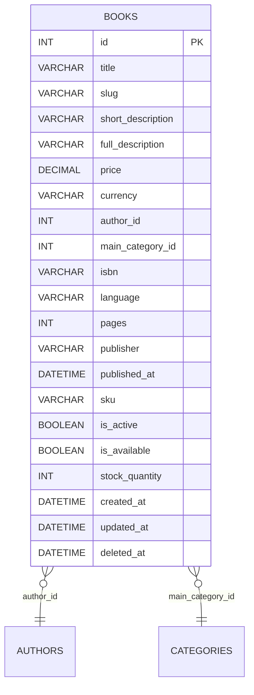

# 📦 Books

   

<!-- Auto-generated from schema-map.psd1 @ 6cefe8e (2025-10-22T20:27:41+02:00) -->

> Schema package for table **books** (repo: `books`).

## Files
```
schema/
  001_table.sql
  # (no deferred indexes declared in map)
  030_foreign_keys.sql
```

## Quick apply
```bash
# Apply schema (Linux/macOS):
mysql -h "$DB_HOST" -u "$DB_USER" -p"$DB_PASS" "$DB_NAME" < schema/001_table.sql
mysql -h "$DB_HOST" -u "$DB_USER" -p"$DB_PASS" "$DB_NAME" < schema/030_foreign_keys.sql
```

```powershell
# Apply schema (Windows PowerShell):
mysql -h $env:DB_HOST -u $env:DB_USER -p$env:DB_PASS $env:DB_NAME < schema/001_table.sql
mysql -h $env:DB_HOST -u $env:DB_USER -p$env:DB_PASS $env:DB_NAME < schema/030_foreign_keys.sql
```

## Docker quickstart
```bash
# Spin up a throwaway MySQL and apply just this package:
docker run --rm -e MYSQL_ROOT_PASSWORD=root -e MYSQL_DATABASE=app -p 3307:3306 -d mysql:8
sleep 15
mysql -h 127.0.0.1 -P 3307 -u root -proot app < schema/001_table.sql
mysql -h 127.0.0.1 -P 3307 -u root -proot app < schema/030_foreign_keys.sql
```

## Columns
| Column | Type | Null | Default | Extra |
|-------:|:-----|:----:|:--------|:------|
| id | BIGINT UNSIGNED | — | — | AUTO_INCREMENT, PK |
| title | VARCHAR(255) | NO | — |  |
| slug | VARCHAR(255) | NO | — |  |
| short_description | VARCHAR(512) | YES | — |  |
| full_description | LONGTEXT | YES | — |  |
| price | DECIMAL(12,2) | NO | 0.00 |  |
| currency | CHAR(3) | NO | 'EUR' |  |
| author_id | BIGINT UNSIGNED | NO | — |  |
| main_category_id | BIGINT UNSIGNED | NO | — |  |
| isbn | VARCHAR(32) | YES | — |  |
| language | CHAR(5) | YES | — |  |
| pages | INT UNSIGNED | YES | — |  |
| publisher | VARCHAR(255) | YES | — |  |
| published_at | DATE | YES | — |  |
| sku | VARCHAR(64) | YES | — |  |
| is_active | BOOLEAN | NO | 1 |  |
| is_available | BOOLEAN | NO | 1 |  |
| stock_quantity | INT UNSIGNED | NO | 0 |  |
| created_at | DATETIME(6) | NO | CURRENT_TIMESTAMP(6) |  |
| updated_at | DATETIME(6) | NO | CURRENT_TIMESTAMP(6) |  |
| deleted_at | DATETIME(6) | YES | — |  |

## Relationships
- FK → **authors** via (author_id) (ON DELETE RESTRICT).
- FK → **categories** via (main_category_id) (ON DELETE RESTRICT).



## Indexes
- No deferred indexes declared for this table.

## Notes
- Generated from the umbrella repository **blackcat-database** using `scripts/schema-map.psd1`.
- To change the schema, update the map and re-run the generators.

## License
Distributed under the **BlackCat Store Proprietary License v1.0**. See `LICENSE`.
